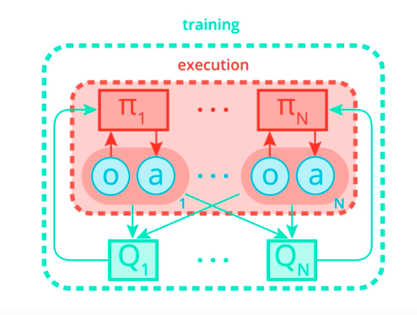
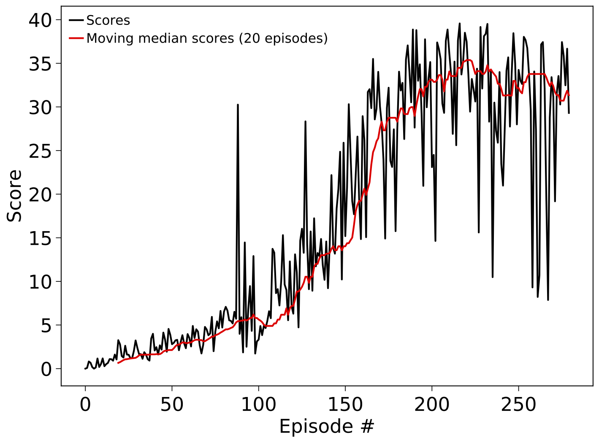

# Report to solving the Tennis environment with MADDPG

## Approach

The **Tennis environment** consists of two agents that are both rewarded by
keeping the ball in play. If each agent maximizes only its own profit, it will therefore
not lead to an optimal solution. The agents have to learn to collaborate to maximize both
of their rewards/scores. This requires them to also take into account the state of the other agent in addtion to their own observed state.
The multi-agent DDPG provices one approach to solve this problem. In this approach, the actors of each agent receive only their respective game states,
while the critics receive the full game states and can therefore learn to maximize the joined rewards. The architecture of the approach is also
depicted in the following schematic:

For execution, the actors only consider the states of their respective agents, while
for training, critics consider the full/joined game state.

Those are the summarized main points underlying the method:
- Neural networks with dense layers and ReLu activations are used to approximate both the actor and critic networks. We converged to use four hidden layers with size 256, 128, 128, and 64 in the final layer.
- To provide a more stable convergence, all four networks are split into separate but architecturally identical local and target networks. At each optimization step, the target network parameters are updated with a soft update.
- The Q-learning side is tackled by optimizing the TD-error/MSBE by continuously minimizing the squared Bellman-equation residual.
- The actions in the target Q-function are taken directly from the target policy. The policy is kept fixed for the Q-learning.
- The policy is trained by simply performing gradient descent on the negative of the current Q-function, given the actions by the policy. The Q-function parameters are kept fixed for this step, only the policy parameters are changed.

More details about the DDPG method in general are nicely summarized here: [https://spinningup.openai.com/en/latest/algorithms/ddpg.html]
The modifications and details of MADDPG are studied in this paper: [https://papers.nips.cc/paper/7217-multi-agent-actor-critic-for-mixed-cooperative-competitive-environments.pdf]

### Implementation details

All relevant parameters used for training can be specified in the config file and are automatically passed to the relevant parts of the code.
The PyTorch networks representing actor and critic were written such as to allow a customizable number and size of dense layers.
We used four layers with 256, 128, 128, and 64 nodes each for both networks.
Experience replay with a memory/buffer size of 100000 was used to obtain training frames from the environment. By default, the actual training samples are
drawn randomly from this memory (with uniform probability). We also implemented prioritized experience replay on the Q-learning part based on the
[original paper](https://arxiv.org/pdf/1511.05952.pdf). However, the implementation hadn't been fully adapted to work with MADDPG yet.

We found that a typical discount factor of 0.99 leads to a worse training and slower convergence than a slightly reduced factor of 0.95.
The parameter tau controlling the soft update, as well as both actor and critic learning rates were set to 0.01. A larger value than usual seems to help convergence.
# TODO: more descriptions needed

## Results

According to the project description, the task is considered solved if the agent obtains a score above 30 when averaged over the last
100 episodes. Our agent is able to solve this task after less than 250 training episodes. Detailed tests with the prioritized replay have not been performed.
We had set our own threshold a bit higher to an average score of 31 over the last 100 episodes, which was reached after around 270 episodes.
The following image contains the training score as a function of the episodes for the latest training run:

It is apparent that, while the environment can be formally considered solved, the variance in scores for different individual episodes is still very large
towards the end of the training period. This is probably due to the fact that the speed and rotation of the ball in the environment changes often.
The agent has learned some modes perfectly while it is still struggling with other ones. The agent should therefore be trained even longer
and possibly the criterion for the solution of 30 should be increased a bit to maybe 35.

The figure, model weights and the config file to reproduce the results are stored in the corresponding folder
in `experiments`. The trained agent can be watched by setting `train_mode=False` and adjusting the paths.

The config file `replay_config.py` is already set-up and configured to replay the trained agent.
So, if you would like to visualize the trained agent, just execute:

`python navigation.py replay_config.py`

## Future steps and improvements

We found that the solution of the environment with DDPG is quite sensitive to training parameters, the network architecture, and also the noise
that has to be added to the actions. Thus, it seems a bit fragile. The solution could be improved by tuning the prioritized replay (settings),
optimizing hyperparameters etc. One could also implement a pure exploration phase at the beginning where actions are uniformly sampled and only switch
to normal agent exploration afterwards. Another improvement would be to change/reduce the noise with increased time or decreased distance to the target score.
Even another potential improvement would be to change the network architectures by adding dropout layers or using batch normalization. This could lead to a better generalization and faster convergence.

Apart from these optimizations in the context of DDPG, it would be worthwhile to study the same environment with different methods, for Trust Region Policy Optimization
or Proximal Policy Optimization (PPO).

One can parallelize the collection of experiences by using the environment with multiple agents and train only one agent in the background on all of those experiences.

We will continue studying some of those improvements.
