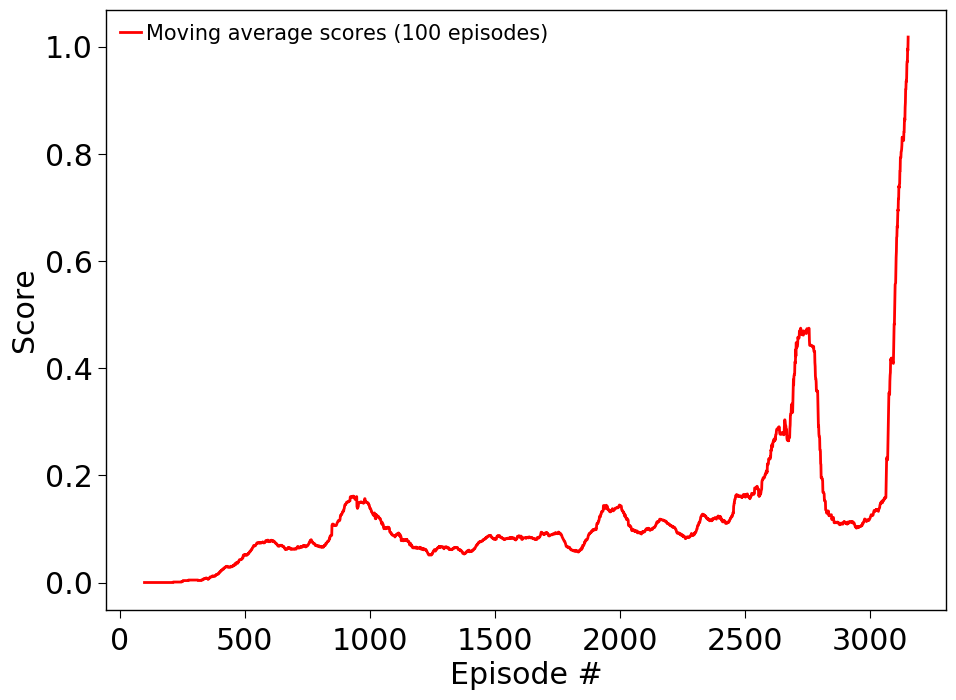

# Report to solving the Tennis environment with MADDPG

## Approach

The **Tennis environment** consists of two agents that are both rewarded by
keeping the ball in play. If each agent maximizes only its own profit, it will therefore
not lead to an optimal solution. The agents have to learn to collaborate to maximize both their own and joined rewards/scores.  
This requires them to also take into account the state of the other agent in addition to their own observed state.
The multi-agent DDPG provides one rather simple approach to solve this problem. In this approach, the actors of each agent receive only their respective game states,
while the critics receive the full game states and can therefore learn to maximize the joined rewards. The architecture of the approach is also
depicted in the following schematic:

For execution, the actors only consider the states of their respective agents, while
for training, critics consider the full/joined game state.

Those are the summarized main points underlying our implementation of the method:
- Neural networks with dense layers and ReLu activations are used to approximate both the actor and critic networks. We converged to use four hidden layers with size 256, 128, 128, and 64 in the final layer.
- To provide a more stable convergence, all four networks are split into separate but architecturally identical local and target networks. At each optimization step, the target network parameters are updated with a soft update.
- The Q-learning side is tackled by optimizing the TD-error/MSBE by continuously minimizing the squared Bellman-equation residual.
- The actions in the target Q-function are taken directly from the target policy. The policy is kept fixed for the Q-learning.
- The policy is trained by simply performing gradient descent on the negative of the current Q-function, given the actions by the policy. The Q-function parameters are kept fixed for this step, only the policy parameters are changed.

More details about the DDPG method in general are nicely summarized here: [https://spinningup.openai.com/en/latest/algorithms/ddpg.html].
The modifications, implications and details of MADDPG are studied in this paper: [https://papers.nips.cc/paper/7217-multi-agent-actor-critic-for-mixed-cooperative-competitive-environments.pdf].

### Implementation details

All relevant parameters used for training can be specified in the config file and are automatically passed to the relevant parts of the code.
The final set of parameters used for training are also found in the file `replay_config.py`, which can be used directly to watch the trained agents.
The PyTorch networks representing actor and critic were written such as to allow a customizable number and size of dense layers.
We used four layers with 256, 128, 128, and 64 nodes each for both networks. We noticed that reducing the number of hidden layers to, for example, only two, hindered the convergence of the training.
Experience replay with a memory/buffer size of 100000 was used to obtain training frames from the environment. By default, the actual training samples are
drawn randomly from this memory (with uniform probability). We also implemented prioritized experience replay on the Q-learning part based on the
[original paper](https://arxiv.org/pdf/1511.05952.pdf). However, the implementation hadn't been fully adapted to work with MADDPG yet.

We found that a typical discount factor of 0.99 leads to a worse training and slower convergence than a slightly reduced factor of 0.95.
The parameter tau controlling the soft update, was set to 0.01. A larger value than usual seems to help the convergence.
We added random noise according to an Ornstein-Uhlenbeck process to the actions from the local actor in order to minimize risks to get stuck in local minima. A scaling factor is introduced to decay the noise with increasing number of played episodes/time.

## Results

According to the project description, the task is considered solved if the agents obtain a score above 0.5 when averaged over the last
100 episodes, and while taking the larger of the two agent scores in each episode. We set our own threshold sighthly higher to an average score over the last 100 episodes of 1.0. This implies that both agents have to be better trained in order to solve the environment.
The following image contains the training score as a function of the episodes for the latest training run:

As visible, the target score of 1.0 was reached at slightly over 3000 episodes. However, the first roughly 300 episodes were used to collect random observations with no learning enacted, yet. Still, it is apparent that the task requires a substantial amount of training, which is partly due to the fact that the agents have to learn to collaborate in the task. The chart of score vs. episodes depicts several local bumps followed by a decrease in the average score. These can be partly explained by individual agents progressing ahead of the other agent while still not collaborating fully. Only at around 3000 episodes, in our case, we can see a very step increase in the scores, implying that both agents learned to collaborate effectively at that point. While we did not continue training further, it is unlikely that there would be severe drops in the performance going on.

The figure, model weights and the config file to reproduce the results are stored in the corresponding folder
in `experiments`. The trained agent can be watched by setting `train_mode=False` and adjusting the paths.

The config file `replay_config.py` is already set-up and configured to replay the trained agent.
So, if you would like to visualize the trained agent, just execute:

`python collaboration.py replay_config.py`

## Future steps and improvements

We found that the solution of the environment with MADDPG is quite sensitive to training parameters, the network architecture, and also the noise
that has to be added to the actions. One has to manually tune quite a few hyperparameters to successfully solve the problem. We added several add-ons to improve the training,  for example a pure exploration phase at the beginning, noise decay, and batch normalization at the input layers of the actor and critic networks. One point to study further is the prioritized experience replay adapted to MADDPG, which should further improve and speed-up the training. It would be also highly interesting to study other multi-agent approaches, for example purely policy based master-slave networks. Those approaches might be less dependent on hyperparameter tuning but could exhibit even higher variance during training.
